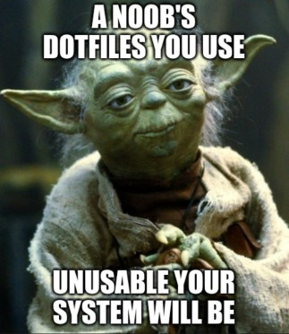

# My Dotfiles


---
This repo includes my configs for:
- zsh
- Kitty
- Neovim
- Sway
- Yabai
- skhd
- Alacritty
- lf
- cmus
*and more...*

## Installing My Dotfiles

My dotfiles are managed with **chezmoi**, so you just run one command to install chezmoi and apply my dotfiles:

> [!CAUTION]
> Chezmoi will kick off bash scripts and Ansible playbooks when initializing, don't run this willy-nilly!

### Unix
```sh
sh -c "$(curl -fsLS get.chezmoi.io)" -- -b $HOME/.local/bin -- init --apply MicahBird
```

### Windows
```powershell
Add-AppxPackage -Path "https://aka.ms/getwinget"
winget install -e --id twpayne.chezmoi
winget install -e --id Git.Git
```
Then put the following contents in `~/.config/chezmoi/chezmoi.toml` (so the script can execute for the first time):
```toml
[interpreters.sh]
    command = "bash"
```
Then finally from Git Bash run:
```sh
chezmoi init --apply MicahBird
```

### Custom Functions/Aliases

#### lfcd
Pressing `CTRL + O` in a zsh session launches lf and changes directories . Look at `lfcd()`in `~/.config/zsh/custom.zsh` for more details

#### wvim
A Neovim config that is built for writing:
Notable features: 
 - `CTRL + S`: Replaces the highlighted word with the first spelling suggestion
 - `zs`: Provides a synonym suggestions menu courtesy of [ron89/thesaurus_query.vim](https://github.com/ron89/thesaurus_query.vim)


#### mvim
A minimal neovim configuration with bare essentials and sensible defaults.

## Credits

Thanks to [charmbracelet/vhs](https://github.com/charmbracelet/vhs) for VHS to create the GIFs on this README!
